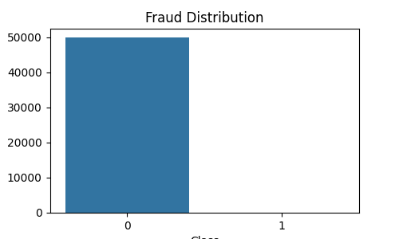
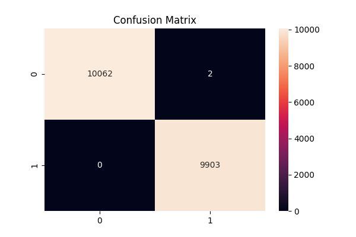
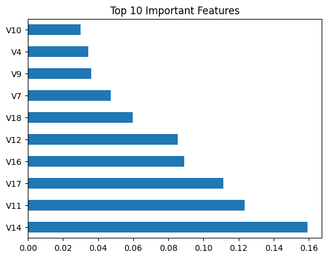
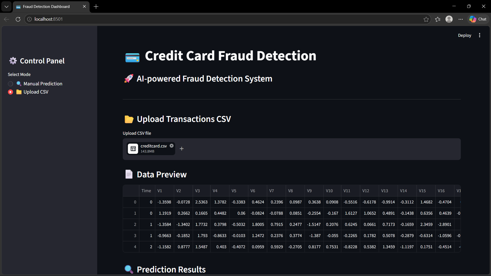
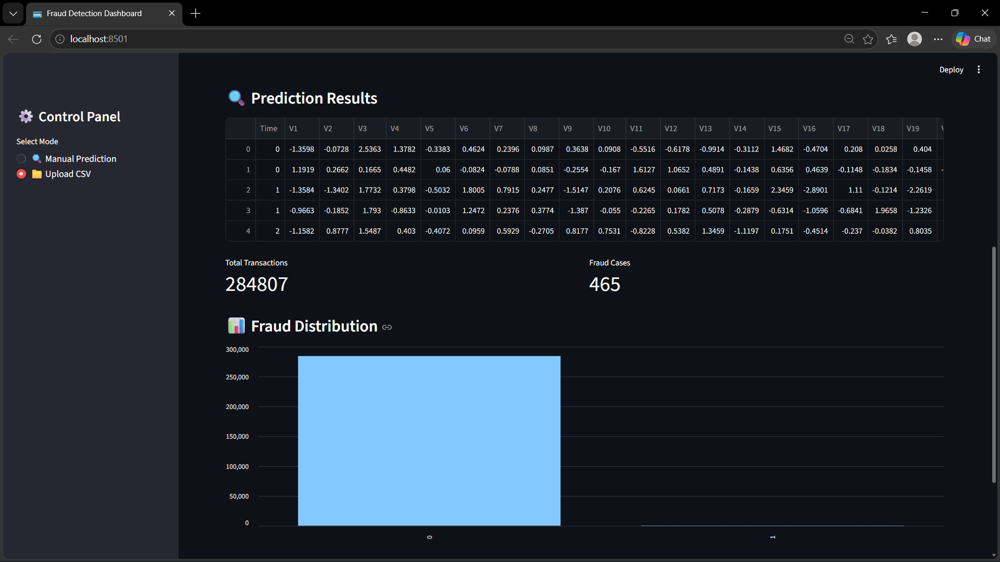
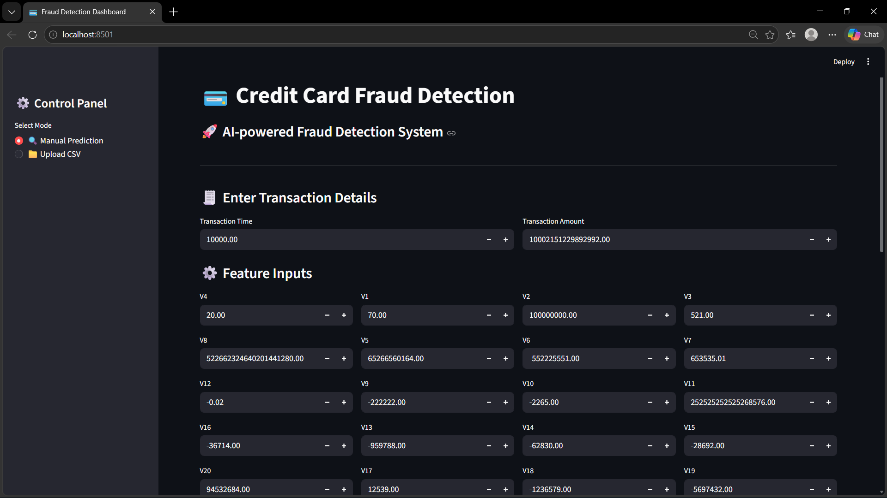
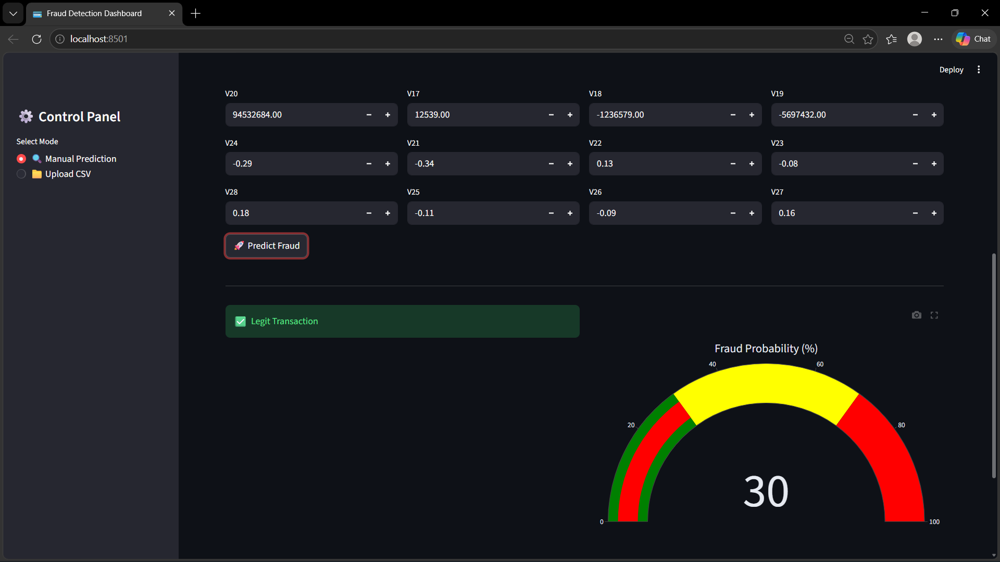

# 💳 Credit Card Fraud Detection ML

## 🚀 Overview

This project is an end-to-end Machine Learning system designed to detect fraudulent credit card transactions. It includes data analysis, model training, evaluation, and an interactive dashboard for real-time predictions.

---

## 🎯 Problem Statement

Credit card fraud leads to significant financial losses. The goal of this project is to build a model that can accurately identify fraudulent transactions while minimizing false positives.

---

## 🧠 Solution Approach

* Performed Exploratory Data Analysis (EDA)
* Handled class imbalance using SMOTE
* Trained Machine Learning models (Random Forest, Logistic Regression)
* Evaluated performance using classification metrics
* Built an interactive dashboard using Streamlit

---

## 📊 Dataset

* Source: Kaggle Credit Card Fraud Detection Dataset
* Total transactions: ~284,807
* Features: 30 (V1–V28 are PCA-transformed for privacy)
* Target:

  * `0` → Normal transaction
  * `1` → Fraudulent transaction

---

## 🛠️ Tech Stack

* Python
* Pandas, NumPy
* Scikit-learn
* Matplotlib, Seaborn
* Imbalanced-learn (SMOTE)
* Streamlit
* Joblib

---

## 📁 Project Structure

```
Credit-Card-Fraud-Detection-ML/
│
├── data/
├── notebooks/
├── src/
├── models/
├── outputs/
├── images/
├── app/
├── main.py
├── requirements.txt
└── README.md
```

---

## 📊 Exploratory Data Analysis

### Fraud Distribution



---

## 🤖 Model Performance

### Confusion Matrix



---

## 📈 Feature Importance



---

## 🖥️ Dashboard

Interactive dashboard built using Streamlit:






---

## ▶️ How to Run

### 1️⃣ Clone the repository

```bash
git clone https://github.com/VaishnavaDevi-R/Credit-Card-Fraud-Detection-ML.git
cd Credit-Card-Fraud-Detection-ML
```

### 2️⃣ Create virtual environment

```bash
python -m venv venv
venv\Scripts\activate
```

### 3️⃣ Install dependencies

```bash
pip install -r requirements.txt
```

### 4️⃣ Run model

```bash
python main.py
```

### 5️⃣ Run dashboard

```bash
streamlit run app/dashboard.py
```

---

## 💡 Key Learnings

* Handling imbalanced datasets using SMOTE
* Understanding PCA-transformed features
* Model evaluation using precision, recall, and confusion matrix
* Building interactive ML dashboards with Streamlit

---

## 🚀 Future Improvements

* Implement XGBoost for better performance
* Add real-time streaming data
* Deploy dashboard online
* Add explainability using SHAP

---

## 👩‍💻 Author

Vaishnava Devi

---

## ⭐ Support

If you like this project, give it a ⭐ on GitHub!
